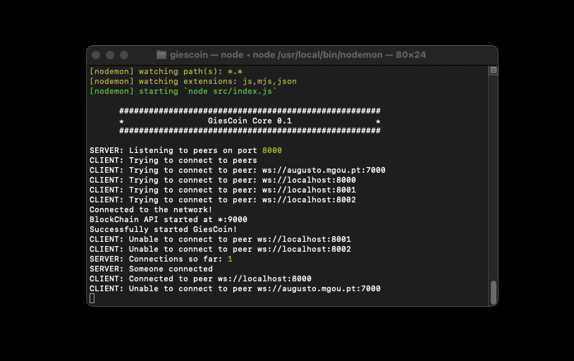

# GiesCoin
> My attempt of creating a decentralized blockchain and cryptocurrency

Cryptocurrencies are digital assets people use as investments and for purchases online. You exchange real currency, like dollars, to purchase “coins” or “tokens” of a given cryptocurrency. There are many kinds of cryptocurrencies. Bitcoin is the most famous, but Ether, Bitcoin Cash, Litecoin, and Ripple are a few others. This is my take on this new technology that has a lot to offer.



## Installation

1. Clone the repo

OS X & Linux:

```sh
npm install yarn --save
yarn
node src
```
<!--  
## Usage example

A few motivating and useful examples of how your product can be used. Spice this up with code blocks and potentially more screenshots.

_For more examples and usage, please refer to the [Wiki][wiki]._

## Development setup

Describe how to install all development dependencies and how to run an automated test-suite of some kind. Potentially do this for multiple platforms.

```sh
make install
npm test
```
-->
## Release History

* 0.1.1
    * General bug fixes
* 0.1
    * First commit

## Meta

FranciscoGiestas – giestas3@gmail.com

Distributed under the MIT license. See ``LICENSE`` for more information.

[https://github.com/FranciscoGiestas/](https://github.com/FranciscoGiestas/)

## Contributing

1. Fork it (<https://github.com/FranciscoGiestas/giescoin/fork>)
2. Create your feature branch (`git checkout -b feature/fooBar`)
3. Commit your changes (`git commit -am 'Add some fooBar'`)
4. Push to the branch (`git push origin feature/fooBar`)
5. Create a new Pull Request

<!-- Markdown link & img dfn's 
[npm-image]: https://img.shields.io/npm/v/datadog-metrics.svg?style=flat-square
[npm-url]: https://npmjs.org/package/datadog-metrics
[npm-downloads]: https://img.shields.io/npm/dm/datadog-metrics.svg?style=flat-square
[travis-image]: https://img.shields.io/travis/dbader/node-datadog-metrics/master.svg?style=flat-square
[travis-url]: https://travis-ci.org/dbader/node-datadog-metrics
[wiki]: https://github.com/yourname/yourproject/wiki-->
